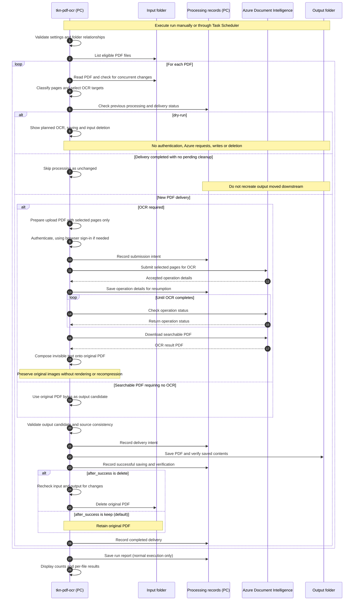

# tkn-pdf-ocr

[日本語](README_ja.md)

See the [Changelog](CHANGELOG.md) for version changes and
[OCR validation](docs/validation.md) for validation evidence and limitations.

Turn scanned PDF files into searchable PDFs with **Azure Document Intelligence Read**
(`prebuilt-read`). Run on a Windows PC and deliver validated PDFs from multiple
input queues to separate output folders. Keep inputs by default, or delete them after
verified delivery with `after_success: delete`. No Tesseract, OCRmyPDF, language packs, WSL, or Power Platform is required.

For example, `input/receipt.pdf` becomes `output/receipt.pdf`, with text you can search
and copy. A normal result contains the following fields (illustrative excerpt):

```json
{"counts": {"created": 1, "replaced": 0, "unchanged": 0, "skipped": 0, "planned": 0, "failed": 0}}
```

Start with setup and the first conversion below. The [command table](#commands) and
[processing contract](docs/reference/processing.md) cover repeat runs and recovery.

The CLI processes one PDF or scans configured folders once. Windows Task Scheduler supplies
the recurring schedule; the CLI does not install a background service.
Normal OCR sends the PDF to Azure and incurs Read analysis charges. Searchable PDF
generation itself has no additional charge according to the
[Read documentation](https://learn.microsoft.com/en-us/azure/ai-services/document-intelligence/prebuilt/read?view=doc-intel-4.0.0#searchable-pdfs).
`--dry-run` only reads local files and settings: no authentication, network, OCR, or writes.

## Processing flow

This diagram shows folder processing with `tkn-pdf-ocr run`. Saving and deletion
proceed only after the checks at each stage succeed.



PDFs that cannot be classified safely, or whose selected OCR pages yield no text,
are held for review: inputs are retained and no new output is published.
Recovery from interruptions and errors is omitted from the diagram. On rerun,
saved operation details allow OCR to resume; when only input deletion remains,
the CLI retries deletion without OCR.
See [recovery and state](docs/reference/processing.md#recovery-and-state) for details.

## Setup

You need Python 3.11 or later, [uv](https://docs.astral.sh/uv/), and an Azure Document
Intelligence resource supporting API `2024-11-30` and searchable PDF output.
The resource and permissions belong to **tkn-azure-platform**; this repository contains
a [ready-to-use infrastructure request](docs/azure-platform-request.md).
Resource creation and deployment are not part of this CLI.

Install from this repository's folder. Replace example paths with real paths:

```powershell
cd "C:\path\to\tkn_pdf_ocr_pipeline"
uv tool install .
tkn-pdf-ocr --help
tkn-pdf-ocr config init
tkn-pdf-ocr config show
```

`config init` prints the configuration file's absolute path, normally
`~/.tkn/pdf_ocr_pipeline/config.yaml`.
Edit that file and set `azure.endpoint`. If no sources are configured (omitted or `{}`
after merging), the built-in `default` source uses:

- Input: `~/.tkn/pdf_ocr_pipeline/data/incoming`
- Output: `~/.tkn/pdf_ocr_pipeline/data/searchable`

Create the input folder and place PDFs there. Outputs are created during processing;
configuration inspection and dry-run never create these folders. The default source keeps
input files, does not recurse, and preserves filenames. `run --source default` selects it.
Defining your own sources uses only those sources, without adding the implicit default.
For custom folders, define named `sources` as below.
Here is a complete minimal configuration; replace both folders and the resource name:

```yaml
schema_version: "3.0.0"
sources:
  receipts:
    enabled: true
    recursive: false
    input_dir: C:/path/to/receipts/1_rawPDF
    output_dir: C:/path/to/receipts/2_ocrPDF
    after_success: delete
    output_suffix: "_ocr"
  catalogs:
    enabled: false
    recursive: true
    input_dir: C:/path/to/catalogs/1_rawPDF
    output_dir: C:/path/to/catalogs/2_ocrPDF
    after_success: keep
    output_suffix: "_ocr"
azure:
  endpoint: https://<resource-name>.cognitiveservices.azure.com
  auth_mode: browser
```

The receipts example deletes input files after verified delivery. Use `keep` to retain
inputs; omission also means `keep`. Enable additional sources when their folders are ready.
Define input/output folders only under `sources.<id>`. Top-level folder settings are not accepted.
All enabled input/output folders and the state folder must be separate and non-nested,
including across different sources. Deletion is a filesystem deletion, not a recycle-bin move.
This CLI verifies local saved bytes; it does not confirm OneDrive cloud synchronization. The default authentication opens your web browser when sign-in is
needed; Azure CLI is not required. Sign in without uploading a PDF:

```powershell
tkn-pdf-ocr auth login
```

Choose the account that can access the resource. Later runs reuse an application-specific
encrypted cache. The first OCR can also prompt for sign-in if you skip this step.
Use `tkn-pdf-ocr auth login --reauthenticate` to select an account again.
`auth login --dry-run` and `config show` do not access the authentication cache or open
a browser. `auth login` acquires a token; resource permissions are checked during OCR.
Set `azure.tenant_id` if you need a specific tenant.

The identity needs the resource-scoped **Cognitive Services User** role and a custom
subdomain endpoint that supports Entra authentication. The Azure platform task sets
up that contract. `config show` does not test authentication.
For an unattended identity or environment-variable key, see
[configuration](docs/reference/configuration.md).

## First conversion and result check

Place a scanned PDF in the input folder. Files modified within the last **30 seconds**
are deferred to avoid reading an incomplete copy. Wait until copying finishes.

Preview a folder run, then perform it:

```powershell
tkn-pdf-ocr run --dry-run
tkn-pdf-ocr run
tkn-pdf-ocr verify "C:\path\to\receipts\2_ocrPDF\receipt_ocr.pdf" --require-text
```

The real run uploads eligible PDFs, saves validated PDFs with the configured suffix,
applies each source's retention policy, and prints a JSON summary. Check `failed`,
`needs_review`, and `cleanup_pending`; inspect `skipped` reasons
when no output appears. Open the result in a PDF viewer and search for known Japanese
store names, dates, or amounts. `verify` checks structural readability and extractable
text; it does not judge recognition accuracy.

To select one file without configuring input/output folders:

```powershell
tkn-pdf-ocr convert "C:\path\to\scan.pdf" --output "C:\path\to\result.pdf"
```

`--output` is required. Endpoint and authentication settings still apply. The source is never overwritten.

## Daily use

Run `tkn-pdf-ocr run` to process all enabled sources, or `run --source receipts` for one.
`run --source receipts --dry-run` previews the target and planned input deletion without
Azure requests, file writes, or deletions. Settings and limits outside `sources` are shared.
Named queues remember completed delivery even after the downstream consumer moves the
output. Changing OCR settings or the suffix does not redeliver the same input path/content.
Keep source IDs and `state_dir` stable. To deliberately OCR a retained file again, use
`convert` with an explicit destination and, if needed, `--redo-ocr`.
Single-file `convert` uses source/settings/output hashes for deduplication.
Set `sources.<id>.recursive: true` to include subfolders for that source and preserve
their relative paths. Each source defaults to `false`; there is no global recursive option.

| Page content | Default | With `--redo-ocr` |
| --- | --- | --- |
| Scan image without text | Add invisible OCR text. | Same. |
| Scan with invisible OCR text | Keep the page unchanged. | Remove old invisible text and add new OCR text. |
| Visible text, such as a Word export | Keep the page unchanged. | Keep the page unchanged. |
| Blank/vector-only or unsupported page | Keep the page unchanged. | Keep the page unchanged. |

Mixed PDFs are processed page by page. Only eligible scan pages are sent to Azure;
all other supported pages remain in the output. Named queues copy already-searchable
PDFs byte-for-byte without Azure, then apply the same verification and retention policy.
Unsupported pages, text drawing without extractable text, wholly text-free input with no
OCR candidates, or any selected OCR page with no resulting text require review; input is
retained and no new output is published. This includes blank scanned pages.
`convert` skips files with no eligible page. `page_kinds` and `ocr_pages` explain the decision in JSON results.

Original encoded images are preserved without rendering or recompression. The CLI
uses only invisible text and font resources from Azure's searchable PDF, then adds them
to the original PDF. It preserves page geometry, visible content, bookmarks, links,
annotations and metadata through document cloning. It does not preserve the PDF file's
bytes or guarantee digital signature validity, PDF/A, or accessibility conformance.

```powershell
tkn-pdf-ocr convert "C:\path\to\scan.pdf" --output "C:\path\to\result.pdf" --redo-ocr
```

`--redo-ocr` is explicit for each invocation; no config setting enables it permanently.
Replacement supports standard invisible text (PDF rendering mode 3), including nested
Form XObjects and Adobe confidence markers. Uncertain visibility or replacement-text
structures are retained as `unsupported`; see [processing limits](docs/reference/processing.md#page-classification-and-limits).
A page containing both visible text and an image is retained as a whole.

The [live preservation comparison](docs/validation.md) checked 20 PDFs / 21 pages with
new Azure OCR: source image data and rendered pixels were identical, with an aggregate
output size of 1.11 times the originals. All 100 selected search items matched; this is
not a full-text accuracy score.

Existing output protection is separate: `--overwrite` permits replacing a conflicting
output, with a uniquely named `.bak-<id>` backup beside it. The source cannot be the
output, even with that option. Identical completed output remains `unchanged`.
To repeat OCR for the same completed input/settings, choose a new output path.

After an interruption, rerun the same command to resume the saved Azure operation.
If only input deletion failed, `cleanup_pending` retries deletion without Azure, after
checking the saved output and input hashes again. If that output has moved or changed,
`needs_review` keeps the input and prevents automatic recreation. A publication interrupted
before its outcome can be confirmed also stops for review if output is missing. Restore
the recorded output only after checking the downstream result; do not clear history as a
routine retry. If deletion finished just before a crash, the next run reconciles its record.
An uncertain submission or expired result requires explicit review before
`--retry-uncertain`, which may create a new billable analysis.
See [recovery and state](docs/reference/processing.md#recovery-and-state).

For automatic folder processing, configure Windows Task Scheduler to execute the
installed `tkn-pdf-ocr.exe` with argument `run` every few minutes.
Use `Get-Command tkn-pdf-ocr` to find the executable.
Choose a fixed **Start in** directory and the same Windows identity/configuration;
disable overlapping task instances. The PC must be awake.
Browser authentication can reuse cached tokens, but a new sign-in requires user interaction.
Use a deliberately configured unattended identity for continuous unattended operation.
No task is registered by installation.

## Commands

| Purpose | Command | Details |
| --- | --- | --- |
| Create settings | `config init [PATH] [--dry-run] [--force]` | [Configuration](docs/reference/configuration.md) |
| Inspect effective settings and their sources | `config show` | [Configuration](docs/reference/configuration.md) |
| Sign in without uploading PDFs | `auth login [--reauthenticate] [--dry-run]` | [Authentication](docs/reference/configuration.md#azure-options) |
| Convert one PDF | `convert INPUT --output OUTPUT` | [Processing](docs/reference/processing.md) |
| Scan configured folders once | `run [--source ID]` | [Processing](docs/reference/processing.md) |
| Inspect a PDF locally | `verify INPUT [--expected-pages N] [--require-text]` | [Verification](docs/reference/processing.md#verification) |

Use `COMMAND --help` for options. Common `--config PATH`, `--quiet`, and
`--verbose` can appear before or after the subcommand.
Progress goes to stderr as `[INFO]`, `[SUCCESS]`, or `[ERROR]`; final results go to
stdout as UTF-8 JSON. `--quiet` keeps errors and JSON; `--verbose` adds diagnostics.
Terminal colors are disabled for redirects, `NO_COLOR`, and unsupported terminals.

Exit codes: **0** success/no eligible work, **1** one or more file failures, review items, or pending deletions,
**2** argument/configuration/command error, **130** interruption.

## Limits and data handling

- PDF input only. Encrypted or structurally invalid PDFs fail before upload.
- Page selection examines text drawing modes and image content. Visible text pages are
  retained; unsupported hidden-text structures are not replaced. This is not an OCR-quality score.
- Default local limits: 2,000 pages and 500 MiB per PDF; these are safety ceilings,
  not a guarantee that the selected Azure tier accepts a document.
  F0 may process only the first two pages; use S0 for full-document operation.
  Truncated output fails page-count validation. Check current
  [service limits](https://learn.microsoft.com/en-us/azure/ai-services/document-intelligence/service-limits?view=doc-intel-4.0.0).
- Original, selected-page upload and Azure response PDFs are held in memory. Large files
  require sufficient memory; no rasterization is performed.
- Only eligible pages are sent, with old invisible text removed. Original image data is
  preserved in the final PDF. Accessibility, signatures, PDF/A and OCR accuracy are not
  guaranteed by structural checks.
- Blank or unreadable pages may have no text. Named queues retain input for review.
  `convert` saves a wholly text-free result with a warning if Azure reports no words. When Azure reports words but downloaded text is
  absent on those pages, publication fails.
- Input deletion is opt-in per named source. No automatic archive, receipt-field extraction,
  issue-date renaming, final document filing, or categorization is performed.
- Output PDFs go to the chosen output folder. Job manifests, run reports, and lock
  files go to `~/.tkn/pdf_ocr_pipeline/state/` by default. No persistent OCR-text JSON
  or application cache is created. These local state files contain paths and hashes;
  protect them as private operational data. Browser account identifiers go to
  `~/.tkn/pdf_ocr_pipeline/authentication/`; tokens stay in an application-specific,
  OS-encrypted cache, never YAML or job reports.
- Billable requests are never automatically retried. Poll/download GETs have bounded
  retries. Local state preserves accepted operations; Azure result retention still applies.
- All cooperating processes must use the same state directory. Filesystem-level
  atomic publication requires a local filesystem supporting hard links/atomic replace.
  Concurrent edits by other applications cannot be made fully transactional.

## Update and development

After updating the repository, reinstall so code, resources, and dependencies match:

```powershell
cd "C:\path\to\tkn_pdf_ocr_pipeline"
uv tool install . --reinstall
tkn-pdf-ocr --version
```

Normal updates use `--reinstall`. Editable installation is only for development:
`uv tool install -e . --reinstall`.
Folder runs use `sources` exclusively (configuration schema `3.0.0`). Define one entry
for a single folder pair or additional entries for multiple queues. When no sources are configured, `run` uses the built-in `default` queue described above.
`convert INPUT --output OUTPUT` uses explicit file paths independently of folder settings.

Development checks:

```powershell
cd "C:\path\to\tkn_pdf_ocr_pipeline"
uv sync --locked
uv run pytest
uv run ruff check .
uv run ruff format --check .
uv run mypy src
uv build
```

Tests use synthetic PDFs and mock Azure HTTP responses; they do not send private
documents or make billable requests. The initial Windows implementation was checked
locally, including packaging. On 2026-09-21, live Azure CLI authentication and OCR
completed for 20 Japanese receipt PDFs (21 pages). A selective 100-item search/extraction
check matched 100 items in Azure output and 72 in the archived Adobe OCR baseline.
This is not a full-text accuracy score; see the [method, results and limits](docs/validation.md).
Linux operation remains unverified.

The MIT-licensed application uses Azure Identity, HTTPX, PyYAML, pypdf and filelock.
Development rendering checks use pypdfium2/Pillow with their dependency notices.
No separate OCR engine or rendering tool is needed for normal CLI use.
See [dependency and architecture notes](docs/reference/processing.md#implementation-boundaries).
