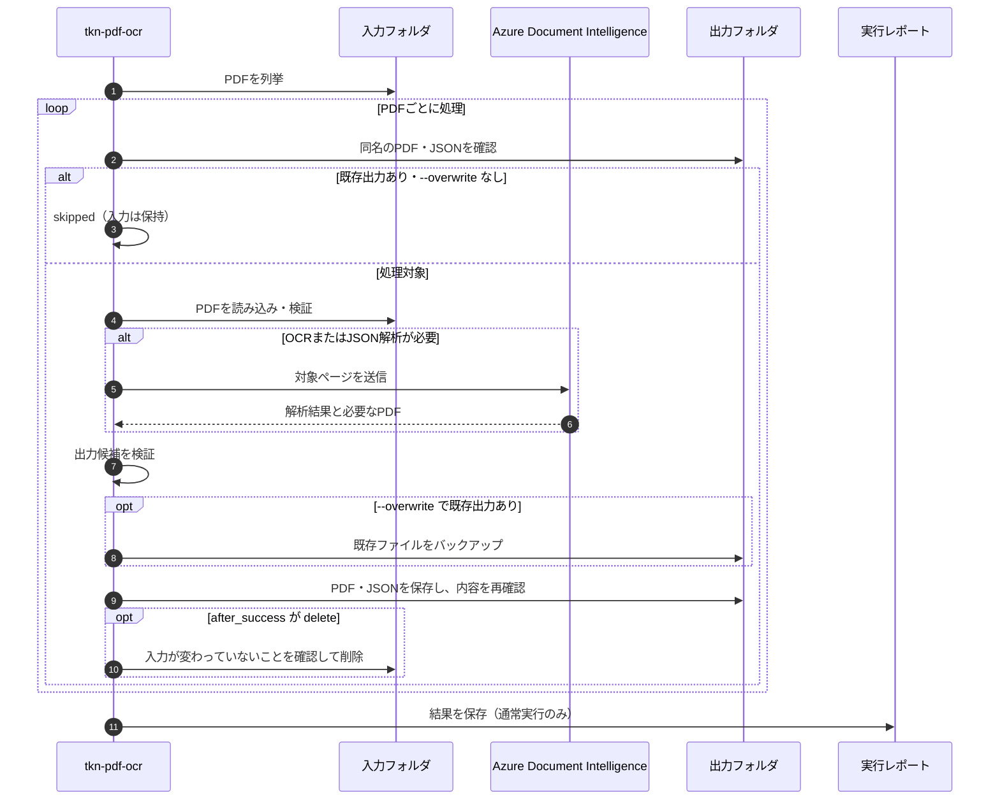

# tkn-pdf-ocr: Tkn PDF OCR — PDFを検索可能にするCLI

画像として保存されたPDFの文字をOCRで認識し、検索・コピーできるPDFを作成するコマンドラインツールです。
例えば、文字を選択できなかった書類で、文中の語句を検索したり、文章をコピーしたりできるようになります。

このCLIは、スキャン画像に、検索・コピー用の非表示文字情報（OCRテキストレイヤー）を追加します。元画像の再描画・再圧縮は行いません。

ページにOCRテキストレイヤーがすでに存在する場合は、通常はそのページを変更せず保持します。`<span>--redo-ocr</span>` を指定すると、古い非表示文字情報を除去し、新しく認識した文字情報に置き換えます。

Wordなどから出力された通常の文字があるページは、OCRせず保持します。これらが混在するPDFでは、対象の画像ページだけをOCRします。名前付きキューでは、OCRが不要な検索可能PDFも、そのまま後段へ引き継ぎます。

認識した全文・ページ別の行・Azureの解析結果をJSONファイルにも保存できます。既定ではPDFだけを出力し、JSONも保存する場合は `--json`、JSONだけの場合は `--only-json` を指定します。

文字認識には **Azure Document Intelligence** のReadモデル（`prebuilt-read`）を使います。

複数の入力フォルダから、検証済みのPDFをそれぞれの出力フォルダへ保存できます。
入力PDFは既定で保持し、対象ごとに `after_success: delete` を指定すると、保存・検証後に削除します。
構造化データの抽出、発行日に基づくリネーム、最終保管先への移動は後段の処理で行います。

## 処理の流れ

JSON出力オプションを指定せず、`tkn-pdf-ocr run` でPDFを出力するときの流れです。図の保存・削除は、各段階の検証が成功した場合に進みます。


```mermaid
sequenceDiagram
    autonumber
    participant CLI as tkn-pdf-ocr
    participant Input as 入力フォルダ
    participant Azure as Azure Document Intelligence
    participant Output as 出力フォルダ
    participant Report as 実行レポート

    CLI->>Input: PDFを列挙
    loop PDFごとに処理
        CLI->>Output: 同名のPDF・JSONを確認
        alt 既存出力あり・--overwrite なし
            CLI->>CLI: skipped（入力は保持）
        else 処理対象
            CLI->>Input: PDFを読み込み・検証
            alt OCRまたはJSON解析が必要
                CLI->>Azure: 対象ページを送信
                Azure-->>CLI: 解析結果と必要なPDF
            end
            CLI->>CLI: 出力候補を検証
            opt --overwrite で既存出力あり
                CLI->>Output: 既存ファイルをバックアップ
            end
            CLI->>Output: PDF・JSONを保存し、内容を再確認
            opt after_success が delete
                CLI->>Input: 入力が変わっていないことを確認して削除
            end
        end
    end
    CLI->>Report: 結果を保存（通常実行のみ）
```

判定できないPDFや、OCR対象ページから文字を取得できなかったPDFは入力を保持し、新しい出力を保存しません。
出力保存前に中断すると、次回は再びAzureへ送信する場合があります。出力保存後に入力が残った場合、次回は同名出力があるためスキップします。詳しくは[処理仕様](docs/reference/processing.md#recovery-and-state)を参照してください。

## 利用前に確認すること

**OCR対象のPDFはAzureへ送信され、文字の解析・認識に料金がかかります。**
ただし、`--dry-run` では処理対象をローカルで確認するだけで、Azureへの送信や課金、ファイルへの書き込みは行いません。
料金は[Azure Document Intelligenceの料金表](https://azure.microsoft.com/en-us/pricing/details/document-intelligence/)で確認できます。

必要なものは次のとおりです。
以下の手順はWindowsのPowerShellを使用します。LinuxでのCLIの動作は未検証です。

- Python 3.11以上と[uv](https://docs.astral.sh/uv/)。
- Azure Document Intelligenceリソース。API `2024-11-30` の検索可能PDF出力に対応している必要があります。
- Webブラウザと、対象リソースの **Cognitive Services User** ロールを持つMicrosoft Entraアカウント。Azure CLIの導入・ログインは不要です。

Azureリソースと権限は、あらかじめ用意してください。
このCLIはAzureリソースを作成・デプロイしません。

## インストールする

リポジトリのフォルダでインストールし、ヘルプが表示されることを確認します。
例のパスは、手元のリポジトリの場所に置き換えてください。

```shell
cd "C:\path\to\tkn_pdf_ocr_pipeline"
uv tool install .
tkn-pdf-ocr --help
```

## 設定する

### 1. 設定ファイルを作成する

```shell
tkn-pdf-ocr config init
```

表示された `path` の設定ファイルを開きます。
既定の保存先は `~/.tkn/pdf_ocr_pipeline/config.yaml` です。`~` はユーザーのホームフォルダを表します。

### 2. 処理対象・保存先・接続先を指定する

`sources` が未指定、または設定を統合した結果が `{}` の場合、`default` という対象で次のフォルダを使います。

- 入力: `~/.tkn/pdf_ocr_pipeline/data/incoming`
- 出力: `~/.tkn/pdf_ocr_pipeline/data/searchable`

入力フォルダを作成してPDFを置いてください。出力フォルダは処理時に作成します。設定確認と `--dry-run` ではフォルダを作成しません。
既定では入力を保持し、サブフォルダは処理せず、ファイル名も変えません。`run --source default` で指定できます。
独自の `sources` を設定した場合は、その対象だけを処理し、既定の対象を追加しません。Azureの接続先設定は別途必要です。

以下は設定ファイル全体として使える最小構成です。
生成されたファイルをそのまま使う場合は、対応する項目を編集してください。

```yaml
schema_version: "3.0.0"
sources:
  receipts:
    enabled: true
    recursive: false
    input_dir: C:/path/to/receipts/1_rawPDF
    output_dir: C:/path/to/receipts/2_ocrPDF
    json_output_dir: C:/path/to/receipts/2_ocrJSON
    after_success: delete
    output_suffix: "_ocr"
  catalogs:
    enabled: false
    recursive: true
    input_dir: C:/path/to/catalogs/1_rawPDF
    output_dir: C:/path/to/catalogs/2_ocrPDF
    after_success: keep
    output_suffix: "_ocr"
azure:
  endpoint: https://<resource-name>.cognitiveservices.azure.com
  auth_mode: browser
```

| 項目                | 設定する内容                                                                                         |
| ------------------- | ---------------------------------------------------------------------------------------------------- |
| `input_dir`       | OCR対象のPDFがあるフォルダ。                                                                         |
| `output_dir`      | OCR後のPDFを保存するフォルダ。                                                                       |
| `json_output_dir` | JSONの保存先。省略または`null` ならPDFと同じ出力フォルダ。設定だけではJSON出力は有効になりません。 |
| `azure.endpoint`  | 利用するAzureリソースのエンドポイント。`<resource-name>` を実際のリソース名に置き換えます。        |

`sources` の各項目に入力・出力フォルダを指定します。`receipts` などのIDは対象の選択と実行結果の表示に使います。IDを変更しても過去の実行結果は現在の処理判断に使いません。
この例の `receipts` は、検証後に入力を削除します。残す場合は `after_success: keep` にします。省略時も `keep` です。
`output_suffix: "_ocr"` により `receipt.pdf` は `receipt_ocr.pdf` になります。省略時は同じ名前です。
追加対象はフォルダを用意してから `enabled: true` にします。
入力・出力フォルダは `sources.<ID>` 内だけに指定します。トップレベルの `input_dir` / `output_dir` は受け付けません。

有効な対象すべての入力・PDF出力・実行レポート・ロックのフォルダは、別のフォルダにし、相互に配下へ置かないでください。JSON出力先は同じ対象のPDF出力先と共用したり、その配下に置いたりできますが、入力・実行レポート・ロック・別の対象のフォルダとは重ねられません。
出力PDFを入力として再び処理することや、元PDFへの上書きを避けるための制約です。
ブラウザ認証では、上記のようなリソース固有のサブドメインを持つエンドポイントを使います。

### 3. 設定を確認する

保存した設定が反映されているか確認します。

```shell
tkn-pdf-ocr config show
```

`settings` に有効な設定、`winning_sources` に各値の取得元が表示されます。
このコマンドは設定の確認用で、Azureへの接続確認は行いません。

### 4. ブラウザでAzureにログインする

```shell
tkn-pdf-ocr auth login
```

初回はブラウザが開くので、対象リソースを使えるアカウントでログインします。
このコマンドは認証だけを行い、PDFの送信・OCR課金は発生しません。リソースへのアクセス権は実際のOCR時に確認されます。
ログインを省略した場合も、最初のOCR時に必要に応じてブラウザが開きます。

次回からはアプリ専用の暗号化キャッシュを使い、再認証が必要になった場合だけブラウザを開きます。
アカウントを選び直すには `tkn-pdf-ocr auth login --reauthenticate` を使います。
`auth login --dry-run` と `config show` は、ブラウザ起動や認証キャッシュへのアクセスを行いません。

利用先のテナントを指定する場合は `azure.tenant_id` を設定します。
無人実行用の認証やAPIキーを使用する場合は、[認証方式の設定](docs/reference/configuration.md#azure-options)を参照してください。

## PDFを検索可能にする

`run` は有効なすべての `sources` を処理します。`run --source receipts` で特定の対象だけを実行できます。
それぞれの `input_dir` にあるPDFを処理し、指定した接尾辞を付けて `output_dir` に保存します。
ページごとに判定し、画像だけのページへOCR文字を追加します。通常の文字があるページとOCR済みのページは保持します。OCR済みページの認識をやり直す場合は[再OCR](#文字認識をやり直す)を使います。

まず、Azureへ送信せずに処理対象を確認します。

```shell
tkn-pdf-ocr run --dry-run
```

結果の `planned` が処理予定の件数です。`source_action: delete` は、検証成功後に入力を削除する予定を示します。
`--dry-run` ではPDFや記録の保存、入力削除は行いません。
対象を確認したら、OCRを実行します。この実行ではPDFをAzureへ送信します。

```shell
tkn-pdf-ocr run
```

OCR後のPDFは `output_dir` に保存されます。
コンソールには作成件数や失敗件数が表示されます。出力がない場合は、[実行結果の読み方](#実行結果の読み方)を確認してください。

コピーや更新の途中にあるファイルを読み込むことを避けるため、最終更新時刻から30秒未満のPDFは処理を見送ります。
該当する場合は、ファイルの更新が終わって30秒以上経過してから再実行してください。
待機時間は `min_age_seconds` で変更できます。

## 用途に応じた使い方

### 設定したソースを選んで実行する（run --source）

`run` コマンドでは通常、config.yaml の `sources` に指定したすべてのソースに対して、OCR化が実行されます。
特定のソースのみOCR化を実行する場合は、`run` コマンドオプションの `--source <source-id>` を指定します。
例えば、以下のような指定となります。

```shell
# receipts の入力フォルダだけを確認する
tkn-pdf-ocr run --source receipts --dry-run

# receipts だけを処理する
tkn-pdf-ocr run --source receipts
```

なお、存在しないsource-idや `enabled: false` のIDを指定するとエラーになります。
`--source` を省略した `run` でも、`enabled: false` に設定したソースは対象としません。

独自の `sources` がない場合は、既定の対象を `run --source default` で指定できます。

対象を1つに絞っても、有効な全対象のフォルダ配置を検査します。別の対象にフォルダの重複がある場合も設定の修正が必要です。
1つのPDFを直接指定する場合は `convert` を使います。

### OCR結果をJSONファイルに保存する

| 指定            | 保存するファイル                                           |
| --------------- | ---------------------------------------------------------- |
| なし            | 検索可能PDFのみ。                                          |
| `--json`      | 検索可能PDFとOCR結果のJSON。                               |
| `--only-json` | OCR結果のJSONのみ。検索可能PDFの生成・取得は要求しません。 |

`--json` と `--only-json` は同時には指定できません。
JSON出力は実行時のオプションで選びます。`json_output_dir` を設定しただけではJSONは保存しません。

```shell
# PDFとJSONの保存予定を確認する
tkn-pdf-ocr run --source receipts --json --dry-run

# PDFとJSONを保存する
tkn-pdf-ocr run --source receipts --json

# JSONだけを保存する
tkn-pdf-ocr run --source receipts --only-json
```

`run` のJSON保存先は `sources.<ID>.json_output_dir` です。省略または `null` の場合は `output_dir` を使います。
PDFと同じ出力名の拡張子を `.json` に変えます。例えば `output_suffix: "_ocr"` なら `receipt.pdf` から `receipt_ocr.json` を作ります。
`recursive: true` の場合は、JSON出力先にも入力からの相対的なサブフォルダ構造を引き継ぎます。

1つのPDFでは、保存先を直接指定できます。

```shell
# PDFの隣に document-searchable.json も保存する
tkn-pdf-ocr convert "C:/path/to/document.pdf" --output "C:/path/to/document-searchable.pdf" --json

# PDFとは別の場所へJSONを保存する
tkn-pdf-ocr convert "C:/path/to/document.pdf" --output "C:/path/to/document-searchable.pdf" --json --json-output "C:/path/to/ocrJson/document.json"

# 元PDFを保持してJSONだけを保存する
tkn-pdf-ocr convert "C:/path/to/document.pdf" --only-json --json-output "C:/path/to/ocrJson/document.json"
```

`convert` は `sources` の保存先設定を使わず、指定したファイルへ保存します。
`--json-output` を省略した場合は、`--output` のPDFと同じフォルダ・同じ名前で拡張子を `.json` にします。
JSONだけの場合も `--output FILE.pdf --only-json` でこの保存先を決められます。`FILE.pdf` 自体は作成しません。

JSONには `sourceFileName`、元PDFのハッシュ、解析対象ページ、および次の認識結果を含めます。

- `TextRecognition.responsev2.predictionOutput.fullText`：Azureが返した全文。
- `TextRecognition.responsev2.predictionOutput.results`：ページ別の文字列と行・位置情報。
- `azureAnalyzeResult`：Azureの元解析結果。単語・座標・信頼度など、返された情報を保持します。

AI BuilderのJSONに近い参照先で全文を利用できますが、AI BuilderのAPI応答を完全に再現するものではありません。認識文字や行順は異なる場合があります。

`--json` はPDFのOCRに使う同じAzure解析からJSONを作成します。既存の文字ページとスキャンページが混在するPDFでは、JSONはOCR対象ページのみの場合があります。`analyzed_pages` と `source_pages` で対象範囲を確認できます。
OCR対象ページがない検索可能PDFに `--json` を付けると、JSON用に全ページをAzureへ送信し、PDFはそのままコピーします。
`--only-json` は、既に文字があるPDFも含めて全ページをAzureへ送信して解析します。PDFからのローカル文字抽出ではありません。`--dry-run` を付けた場合は送信・保存しません。

JSON出力を後から有効にした場合、入力が残っていても同名のPDF出力があればスキップします。保持しているPDFからJSONだけを作る場合は `convert --only-json` を使えます。既存JSONも既定ではスキップし、置き換えるには `--overwrite` が必要です。
保存の確認と途中停止時の扱いは[JSON出力の処理仕様](docs/reference/processing.md#optional-ocr-json)を参照してください。

### 1つのPDFを指定する

`convert INPUT --output OUTPUT` で、処理対象と保存先を直接指定します。PDFを出力する場合は `--output` が必須です。JSONだけの場合は `--only-json --json-output FILE.json` を使えます。
パスを実際のファイルに置き換えて実行してください。

```shell
tkn-pdf-ocr convert "C:\path\to\document.pdf" --output "C:\path\to\document-searchable.pdf"
```

### サブフォルダも処理する

対象の `sources.<ID>` 内に `recursive: true` を指定します。省略時は `false` です。

```yaml
sources:
  receipts:
    input_dir: C:/path/to/receipts/1_rawPDF
    output_dir: C:/path/to/receipts/2_ocrPDF
    recursive: true
```

対象ごとに設定でき、トップレベルの `recursive` やCLIの一括指定はありません。

`input_dir` 内のサブフォルダも対象にし、フォルダ構造を `output_dir` に引き継ぎます。

### 追加したPDFを処理する

`tkn-pdf-ocr run` を再実行します。
名前付きキューでは、後段が出力を移動しても、完了した入力のパスと内容を記録して再生成を防ぎます。
処理条件や接尾辞を変更しても、同じ入力を再処理しません。再OCRが必要な場合は、保持しているPDFに対して `convert` と明示的な出力先を使います。
単体変換の `convert` では、元PDF・処理条件・出力の内容を使って完了判定します。[再処理の条件](docs/reference/configuration.md#reprocessing-consequences)を参照してください。

### 文字認識をやり直す

`--redo-ocr` を付けると、スキャン画像に重なる古い非表示文字だけを除去し、新しく認識した非表示文字を追加します。

| ページの内容                                   | 通常の実行              | `--redo-ocr` 指定時        |
| ---------------------------------------------- | ----------------------- | ---------------------------- |
| 紙をスキャンした画像だけ                       | 非表示のOCR文字を追加。 | 同じ。                       |
| スキャン画像と非表示のOCR文字                  | OCR済みとして保持。     | 古い非表示文字を除去・置換。 |
| Wordなど由来の通常の文字                       | OCRせず保持。           | OCRせず保持。                |
| 白紙・画像のないページ・安全に判定できない構造 | 保持。                  | 保持。                       |

混在PDFでは、対象の画像ページだけをAzureへ送信し、その他のページは元のまま出力に含めます。
JSON出力を指定しない名前付きキューでは、すでに検索可能なPDFはAzureへ送信せず、バイト列を変えずにコピーして、同じ検証・入力保持方針を適用します。
判定不能なページ、文字が抽出できない文字ページ、OCR対象も文字もないPDF、OCR対象ページの一部でも文字が得られないPDFは `needs_review` とし、入力を残します。新しい出力は保存しません。白紙のスキャンもこの確認対象になります。
JSON出力を指定しない `convert` は、対象ページがなければスキップします。
同じページに通常の文字と画像が混在する場合は、そのページ全体を保持します。

```shell
tkn-pdf-ocr convert "C:\path\to\document.pdf" --output "C:\path\to\document-searchable.pdf" --redo-ocr
```

元画像の再描画・再圧縮は行いません。Azureの返すPDFから非表示文字とフォントを取り出し、元PDFへ追加します。
ページ寸法、画像、通常の描画、しおり、リンク、注釈、メタデータを引き継ぎます。
PDFファイル全体のバイト列の一致や、電子署名の有効性、PDF/A・アクセシビリティへの適合を保証するものではありません。
元PDFへの上書きは行いません。入力削除は、名前付きキューで `after_success: delete` を指定した場合だけです。

置換対象は標準的な非表示文字（描画モード3）です。別形式の非表示表現や代替テキストなど、判定が不確かなページは `unsupported` として保持します。[対応範囲](docs/reference/processing.md#page-classification-and-limits)を参照してください。
`--redo-ocr` は実行のたびに指定します。設定ファイルで常時有効にする項目はありません。

実サンプル20件・21ページを新方式でAzure OCRし、元画像のデータと描画結果の一致を確認しました。出力容量は合計で元の約1.11倍です。
選んだ100項目はすべて検索できました。全文の認識率を示すものではありません。[検証記録](docs/validation.md)に方法と範囲を記載しています。

### 保存先に同名のファイルがある場合

PDFまたは要求したJSONの保存先に同名ファイルがあれば、既定では `skipped` として入力を保持します。Azureへの送信は行いません。`--overwrite` を指定した場合は、既存の出力を `.bak-<id>` ファイルにバックアップしてから置き換えます。元PDFを保存先に指定することはできません。

`--overwrite` はOCR済みページの再OCRを有効にしません。必要な場合は `--redo-ocr --overwrite` を指定します。

### 中断した処理を確認する

出力がない場合、再実行は新しいAzure解析を開始します。出力がある場合、再実行はそのPDFをスキップし、入力削除だけを自動で再試行しません。出力と入力を確認して手動で整理してください。Azureへの送信後に中断した場合、再送信で追加料金がかかることがあります。

### フォルダを定期的に処理する

このCLIには、常駐してファイルの追加を検知し、自動で処理する機能はありません。
定期的に処理する場合は、Windowsではタスクスケジューラ、Linuxでは[cron](https://man7.org/linux/man-pages/man5/crontab.5.html)などから `tkn-pdf-ocr run` を実行します。
LinuxでのCLIの動作は未検証です。

Windowsのタスクスケジューラでは、次の内容を設定します。

| 項目             | 設定                                                                                                         |
| ---------------- | ------------------------------------------------------------------------------------------------------------ |
| プログラム       | `Get-Command tkn-pdf-ocr` で確認した `tkn-pdf-ocr.exe` のパス。                                          |
| 引数             | `run`。対象を絞る場合は `run --source receipts`、JSONも保存する場合は `run --source receipts --json`。 |
| 開始するフォルダ | 手動実行で使用した作業フォルダ。                                                                             |
| 実行ユーザー     | 手動実行と同じ設定・認証を利用できるWindowsユーザー。                                                        |
| 多重起動         | 前回の処理が続いている場合は、新しい処理を開始しない設定。                                                   |

PCの電源が入り、スリープしていない間に実行できます。
ブラウザ認証はキャッシュが有効な間は再利用できますが、再認証時にはユーザー操作が必要です。
継続的な無人実行には、[無人実行用の認証](docs/reference/configuration.md#azure-options)を設定してください。

## 入力削除と途中停止

`after_success: delete` は、要求した出力の保存とハッシュ検証が終わり、入力が変わっていないことを再確認してから入力を削除します。`--json` ではPDFとJSONの両方、`--only-json` ではJSONを確認します。削除はごみ箱を経由しません。OneDriveへの同期完了は確認しません。

入力削除に失敗した場合は `needs_review` となり、出力と入力が残ります。次回は同名出力があるためスキップします。入力の確認と整理は手動で行ってください。

## 実行結果の読み方

進捗やエラーはコンソールの標準エラーへ、最終結果は標準出力へJSONで表示します。
この実行結果のJSONと、ファイル保存するOCR本文のJSONは別です。
`run` と `convert` の結果には、次の件数が含まれます。件数は入力PDF単位です。`--json` でPDFとJSONを保存しても1件、`--only-json` ではJSONの保存結果として数えます。

| 項目             | 意味                                                                          |
| ---------------- | ----------------------------------------------------------------------------- |
| `created`      | 主な出力（PDF、`--only-json` ではJSON）を新規保存した入力PDF。              |
| `replaced`     | `--overwrite` により主な出力をバックアップして置き換えた入力PDF。           |
| `skipped`      | 条件により処理を見送ったPDF。`files` 内の `reason` で理由を確認できます。 |
| `planned`      | `--dry-run` で処理予定になったPDF。                                         |
| `failed`       | 処理に失敗したPDF。`files` 内の `error` で原因を確認できます。            |
| `needs_review` | 検証または入力削除の確認が必要なPDF。入力は保持します。                       |

`skipped` の理由が `output_exists` または `json_output_exists` なら、同名の出力が既にあり、Azureへ送信せず入力を保持しました。`no_eligible_pages` ならOCR対象ページがありません。`page_kinds` にページ順の判定（`scan`、`ocr_text`、`native_text`、`no_scan_image`、`unsupported`）、`ocr_pages` にOCR対象のページ番号が表示されます。`input_not_stable_yet` は最終更新からの待機時間を満たしていない場合です。
`sources` に対象ごとの件数、`files` に `source_id` と個別結果が表示されます。
`failed: 0` でも `needs_review` を確認してください。すべてのPDFが `skipped` なら、新しい出力は作成されません。

`--dry-run` 以外では、実行レポートもファイルに保存します。
保存先は結果の `run_report` に表示されます。強制終了などでレポートが残らない場合があります。

終了コードは、`0` が正常終了または処理対象なし、`1` が1件以上のファイル失敗・要確認、`2` が引数・設定などのエラー、`130` が中断です。

## コマンド一覧

コマンド名の前に `tkn-pdf-ocr` を付けて実行します。

| 目的                                 | コマンド                                               |
| ------------------------------------ | ------------------------------------------------------ |
| 設定ファイルを作る                   | `config init [PATH] [--dry-run] [--force]`           |
| 有効な設定と取得元を確認する         | `config show`                                        |
| 1つのPDFをOCRする                    | `convert INPUT --output OUTPUT`                      |
| OCR結果をPDFとJSONで保存する         | `run [--source ID] --json`                           |
| OCR結果をJSONだけで保存する          | `run [--source ID] --only-json`                      |
| 1つのPDFからJSONだけを保存する       | `convert INPUT --only-json --json-output FILE.json`  |
| `input_dir` のPDFをまとめてOCRする | `run [--source ID]`                                  |
| PDFのページ数と文字の有無を調べる    | `verify INPUT [--expected-pages N] [--require-text]` |

各コマンドの `--help` でオプションを確認できます。
共通の `--config PATH`、`--quiet`、`--verbose` はサブコマンドの前後に指定できます。
`--quiet` は進捗を省いてエラーと結果のJSONを表示し、`--verbose` は診断情報を追加します。

## 設定ファイルと実行レポートの保存先

設定は次の順に読み込み、後の値を優先します。`azure` と `sources.<ID>` 内の項目も個別に統合します。

1. 組み込みの既定値。
2. `~/.tkn/pdf_ocr_pipeline/config.yaml`。
3. 実行時フォルダの `./.tkn/config.yaml`。
4. `--config` で指定したファイル。
5. コマンドに指定した個別のオプション。

相対パスの基準は、設定ファイルの場所ではなく、コマンドを実行したフォルダです。`config init` は既存の編集済み設定を保護します。`--force` を付けるとバックアップしてから置き換えます。詳細は[設定仕様](docs/reference/configuration.md)を参照してください。

実行レポートと多重実行を防ぐロックファイルは、既定で `~/.tkn/pdf_ocr_pipeline/state/` に保存します。`runs/` は実行ごとの結果を記録する履歴で、次回の処理判断には使いません。`locks/` は同時実行を調整します。レポートにはファイルのパスやハッシュが含まれますが、OCR本文は保存しません。

ブラウザ認証のアカウント識別情報は `~/.tkn/pdf_ocr_pipeline/authentication/` に保存します。アクセストークン等はOSで暗号化するアプリ専用キャッシュへ保存し、設定ファイルや実行レポートへ書き込みません。[処理仕様](docs/reference/processing.md#recovery-and-state)も参照してください。

## PDFの検査と制限

OCR後、保存前にCLIがPDFを読み取り、元PDFとのページ数・ページ寸法の一致を確認します。
画像データとその解釈に必要な情報が変化していないことも確認します。Azureが文字を検出したページでは、PDFから文字を抽出できることを確認します。
これらはファイルの構造と文字の有無の検査であり、認識した文字が正しいかの判定ではありません。

既存のPDFを調べるには `verify` を使えます。
`--require-text` を付けると、1ページも文字を抽出できない場合にエラーになります。
この検査のためにAzureへ送信することはありません。

- 処理対象はPDFです。暗号化されているPDFや、構造が不正なPDFは送信前にエラーになります。
- 既定の上限は1ファイル2,000ページ、500 MiBです。Azure側にもプランごとの上限があります。無料のF0では先頭2ページまでのため、3ページ以上を処理する場合はS0が必要です。[サービスの上限](https://learn.microsoft.com/en-us/azure/ai-services/document-intelligence/service-limits?view=doc-intel-4.0.0)も確認してください。
- PDF全体とAzureの返すPDFをメモリに読み込みます。大きな文書には十分なメモリが必要です。
- 白紙など、Azureが文字を検出しなかったページには文字が付かない場合があります。名前付きキューではOCR対象ページに文字が得られない場合は要確認として入力を保持します。`convert` では、Azureが単語を検出していなければ警告付きで保存します。
- ページの判定は文字の描画命令・描画モード・画像の有無に基づきます。フォント情報の欠落など、解釈できない構造は保持またはエラーになります。
- すべてのPDF閲覧ソフトでの表示や、アクセシビリティ、署名、PDF/Aへの適合は、上記の検査では確認できません。

再送信の扱い、保存中の競合、強制終了後の一時ファイルの処置などは[処理仕様](docs/reference/processing.md)を参照してください。
複数のCLIから同時に使う場合は、同じ `state_dir` を使用します。
保存先には、ハードリンクとファイルの原子的な置換に対応したローカルファイルシステムが必要です。他のアプリによる同時編集を完全に防ぐことはできません。

## CLIを更新する

リポジトリを更新した後、以下の操作で再インストールして変更を反映します。

```shell
cd "C:\path\to\tkn_pdf_ocr_pipeline"
uv tool install . --reinstall
tkn-pdf-ocr --version
```

フォルダ処理の設定は `sources` に統一しています（設定形式 `3.0.0`）。フォルダが1組の場合も1つの項目として指定します。
`sources` が未設定なら、`run` は上記の既定フォルダを使います。単体変換の `convert INPUT --output OUTPUT` はフォルダ設定なしで利用できます。

## 開発する

開発時にソースの変更を直接反映する場合は、`uv tool install -e . --reinstall` を使います。
テストとパッケージの確認は次の手順で行います。

```shell
cd "C:\path\to\tkn_pdf_ocr_pipeline"
uv sync --locked
uv run pytest
uv run ruff check .
uv run ruff format --check .
uv run mypy src
uv build
```

バージョンごとの追加・変更は[変更履歴](CHANGELOG.md)、検証方法・結果・確認範囲は[検証記録](docs/validation.md)を参照してください。

テストは合成PDFとAzureの応答を模したデータを使います。
日本語PDFを使った実OCRの確認範囲と結果は[検証記録](docs/validation.md)を参照してください。

アプリケーションは[MITライセンス](LICENSE)です。
依存ライブラリの用途とライセンスは[実装構成](docs/reference/processing.md#implementation-boundaries)に記載しています。
